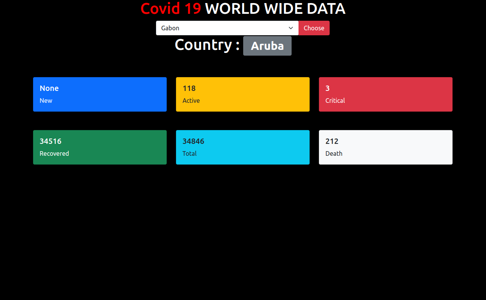

# Django-HTML-Covid19-Live-Data



to run this project firstly create forlder then inside folder create virtualenvironment and activate it

## to create virtual environment try below command

go to your project folder > then type

virtualenv venv

## to activate the virtual environment ( in linux )

```
. env/bin/activate
```

# then clone the project

## then run this command to install other components used in this project
```
pip install -r requirements.txt
```
